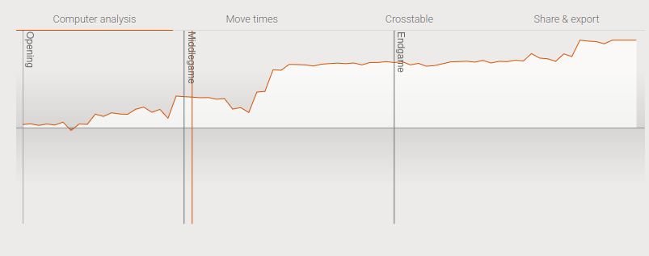
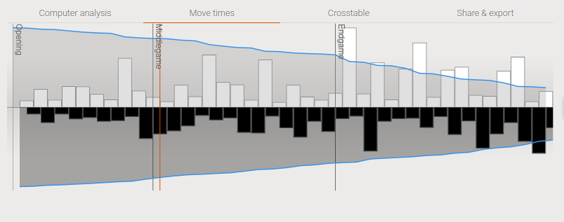
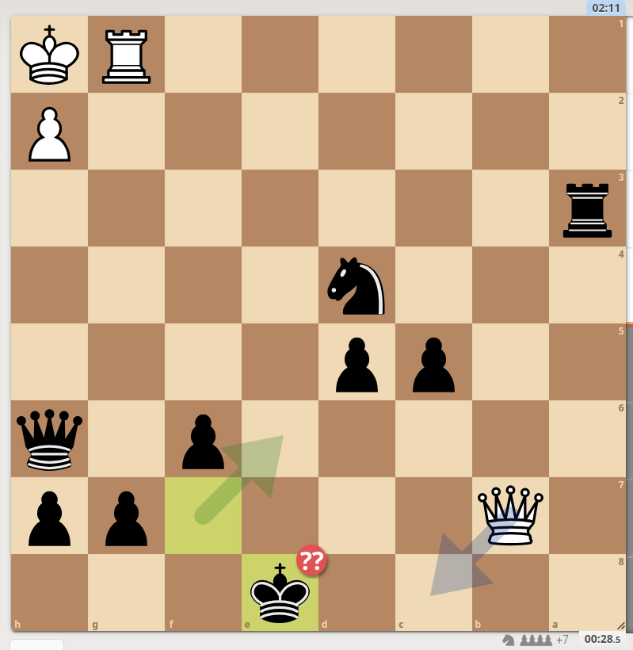

# 07-07-2025

Starting these notes off with playing 3 Blitz games isn't a bad routine.
I try to always focus on a single aspect of playing at the time.
Right now the focus is just on avoiding blunders.
I don't care so much about winning or losing, but I want to avoid wild games.
I'm looking for an evaluation pattern like in [this first game](https://lichess.org/ekKTBgYk/white):

Slowly increasing my grip on the game and waiting for my opponent to blunder.
To do this time management is crucial.
This is still something to work on.
For example in this first game the evaluation pattern looked nice, but I still blitzed out a lot of moves:

Making a move within a second actually shouldn't happen.
You should always think at least two or three seconds to make sure your opponent's move did nothing special.
 
 ---

In the game after that I did exaggerate a bit too much on the side of caution.
I steadily built on my advantage but got too low on time.
I only had 30 seconds left while he had 2 minutes left.
Should have just closed everything down but I started letting him check me.

In itself nothing too bad but too much to calculate so after that I started dropping pieces left and right.

---

[The last game](https://lichess.org/it1MlQ5W) was how it has to be done.
Steadily building an advantage.
In the endgame I did blitz out some moves but there wasn't any danger in those.

---

A small analysis focused just on time management makes a lot of sense.
Now I start to win games just because I've got the game under control.
The biggest danger will be playing too slow, but I can remedy that later on.
The great thing about time management is you can improve just by thinking about it consistently.