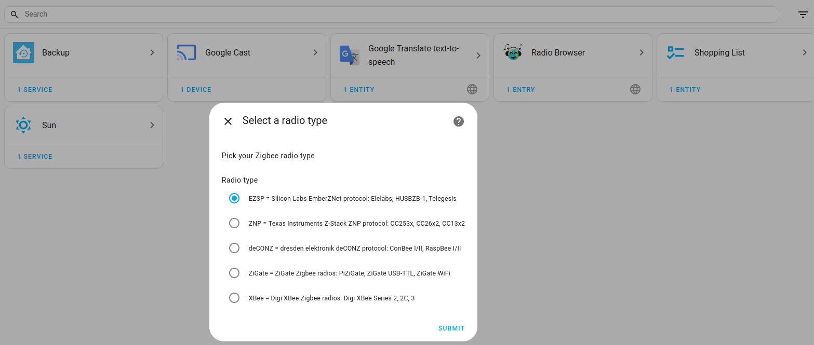

# 09-07-2025

Starting off with 3 games of Blitz just to get the day started.
Excellent habit to get in the right mindset.

---

Time mananagement in [the first game](https://lichess.org/QtecyESL) was fine.
Took enough time for each move, but didn't get way behind on time.
The crucial mistake was underestimating his mating threat:


Qc7 would have liberated some place for my rook to go to d7 and defend b7.

--- 

In [this game](https://lichess.org/MIezJ3cm) I lost because I didn't take my chances.
I had a bishop and rook in the attack, both able to attack the f7 square but I didn't think about this plan and instead randomly began centralizing my bishop on e4. That bishop is not really better placed in the center.


---

In [the last game](https://lichess.org/YugDUfWN) I got into time trouble, even with an overwhelming advantage. But this shouldn't have happened. [At move 18](https://lichess.org/YugDUfWN/black#35) I had an advantage of 6.5 centipawns. After that I spent an excessive amount of time on obvious positions like this:


In this situation as Black there's no reason not to exchange. Simplify and just finish the game, no need to overthink.

---

I want to get back into home automation.
Before I had a small [Zigbee](https://www.home-assistant.io/integrations/zha/#zigbee-terminology) lamp setup in [Home Assistant](https://www.home-assistant.io/).
Not sure if this is still operational, so time to rebuild it.
I do remember setting it up the first time with the SkyConnect dongle was extremely easy. Just a matter of plugging in the lamps and SkyConnect automatically discovered them.

Zigbee:

> A mesh-network of devices with low-power digital radios using a low-bandwidth communication protocol.

I recently bought a [IKEA INSPELNING plug](https://www.ikea.com/be/nl/p/inspelning-stekker-smart-stroommonitor-40569839/) which should be Zigbee compatible. Before trying out the full `SkyConnect > Home Assistant on Raspberry Pi > lamp` setup, I'd just like to see if I can make it work by using Home Assistant Docker version on my local laptop. Home Assistant has a tutorial [how to install HA as a container](https://www.home-assistant.io/installation/generic-x86-64#install-home-assistant-container).

Getting the container up and running is easy with this command:

```
docker run -d \
  --name homeassistant \
  --privileged \
  --restart=unless-stopped \
  -e TZ=America/Los_Angeles \
  -v $HOME/Downloads:/config \
  -v /run/dbus:/run/dbus:ro \
  --network=host \
  ghcr.io/home-assistant/home-assistant:stable
```

I did notice when running `docker ps` no ports are forwarded so something went wrong. Instead now I do the port forwarding manually myself:

```
docker run -d --name homeassistant -p 8123:8123 -v $HOME/Downloads:/config ghcr.io/home-assistant/home-assistant:stable
```

This way when I open `http://localhost:8123/` in the browser I get the Home Assistant onboarding screen displayed.

The onboarding went fine but when I add the Zigbee Home Automation integration, I get asked to specify the radio type:



No idea what this is about but according to [this post](https://community.home-assistant.io/t/skyconnect-which-radio-type-to-select/529963) EZSP is the answer:

> I really don’t know the answer to your question, but from my research, the SkyConnect has the SiLabs EFR32MG21, and the Zigbee stack for this device is EZSP.