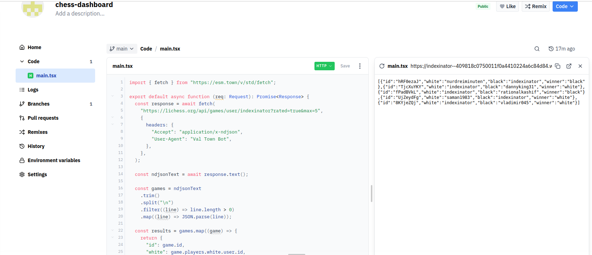

# 09-08-2025

As mentioned [yesterday](../08-08-2025/08-08-2025.md), I gave Val Town a try.
As a test I tried to reproduce in Val Town the [chess dashboard](https://github.com/IsaacVerm/chess-dashboard) I implemented a while back using GitHub Actions.
This turned out not to be that hard:

---

If you add HTTP as trigger in Val Town, it directly creates a link you can use to [check the results](https://indexinator--409818c0750011f0a4410224a6c84d84.web.val.run/). You can make this link public so if you create a small API in the browser you can instantly share it with someone else. This is a huge improvement over my previous 
workflow of creating a GitHub repo, setting up a Python virtual environment, installing Flask, writing Flask code, serving the Flask app and pushing to a cloud provider like Digital Ocean or Heroku. Making things easy to do has two benefits: it's more enjoyable and more productive at the same time.

---

The biggest drawkback of using Val Town is you're limited to JavaScript. I'd love to have the same thing for Python code. This probably means I'll keep some use cases in GitHub Actions still since that allows me to keep using `bash` libraries like `curl`, `jq` and Python libraries.

---

Something to look further into is version control. Right now I make all modifications in the Val Town browser editor. This seems to have a rudimentary branches and pull requests setup, but this isn't integrated into `git`. [Val Town does offer a CLI](https://github.com/val-town/vt) which I could use in combination with `git` + `vscode`.

---

Another good thing about Val Town is the [examples](https://www.val.town/explore/use-cases) provided. Say you want to experiment with scraping in Val Town but don't know where to start. You can just [clone an existing val](https://docs.val.town/integrations/browserbase/), see how it works and adapt what you need to.

---

Val Town can extend [the idea I've started using before of using GitHub as a database](../11-07-2025/11-07-2025.md). You can use GitHub as the database, have a Val Town val extract and do some minimal transformations to the data and then consume this data in whatever way you want (I'm thinking about learning some Power BI for this soon).

---

Having a lot of tools in the same place is really handy.
Right now I use GitHub Actions, Codespaces and its browser editor and I can do a lot of things in the browser I used to do in VSCode. In terms of creating a monopoly over development tools maybe not the best thing though, but practical in any case.