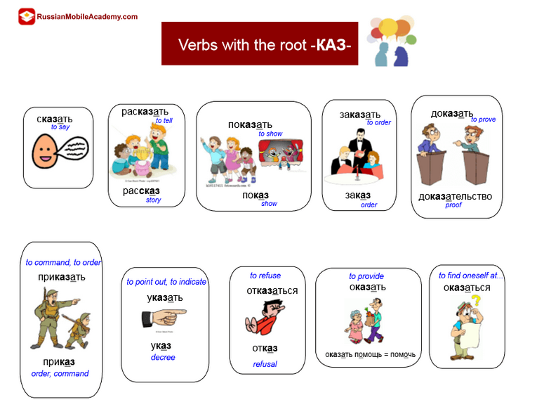
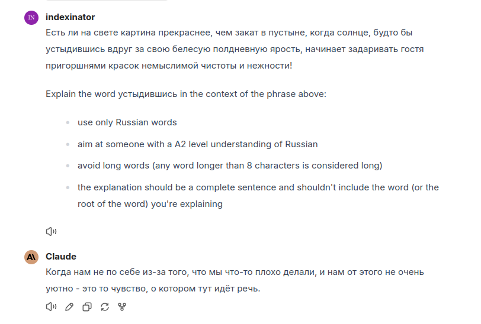
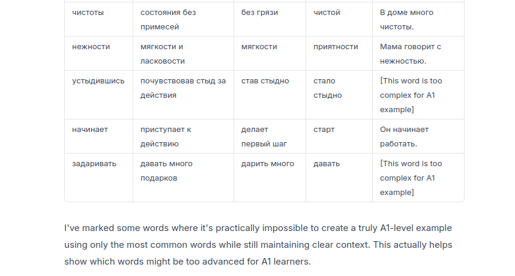

# building a web app to help with reading a foreign language
## what triggered building this app?

Recently I went to a [Lord of the Rings concert](https://www.ccbrugge.be/agenda/4483/mystery-ensemble-by-la-chapelle-sauvage/the-music-of-the-lord-of-the-rings). Since I've been brushing up my Russian skills, it got me wondering whether a Russian version of Lord of the Rings is available. This made me stumble on [Последний кольценосец](https://en.wikipedia.org/wiki/The_Last_Ringbearer), an apocryphal version of Lord of the Rings:

> Kirill Yeskov bases his novel on the premise that the Tolkien account is a "history written by the victors". Mordor is home to an "amazing city of alchemists and poets, mechanics and astronomers, philosophers and physicians, the heart of the only civilization in Middle-earth to bet on rational knowledge and bravely pitch its barely adolescent technology against ancient magic", posing a threat to the war-mongering faction represented by Gandalf (whose attitude is described by Saruman as "crafting the Final Solution to the Mordorian problem") and the Elves.

I found the idea behind the book interesting, but the [text in Russian itself](https://fan.lib.ru/e/eskov/last_ringlord.shtml) is too hard for me. Having recently experimented with [using an LLM for language learning](https://mini-computer.tail1ad9dd.ts.net/posts/how-to-use-llms-for-learning-a-language-ru), I decided to try to create an app incorporating an LLM to help out. 

## what problem does this app solve?

When I tried to read Последний кольценосец, I noticed these aspects made it hard for me to read the text:

- the sentences are long
- the words used are difficult

Both of these problems can be attacked with an LLM. You can use the LLM to make the sentences (semantically) shorter and to dumb down the words.

## what does the app focus on?

The app tries to make a difference in three ways:

- it focuses on the roots of the word
- it cuts sentences in semantically sensible pieces
- it provides hints in language easier understood than the source language

Combining these three, it becomes possible to read the text even when you're not proficient enough yet.

### root of the word

Russian words are notoriously long, but often the root of the word is short and returns in many different words. [Knowing the root can help a lot both with understanding and remembering](http://russian.cornell.edu/grammar/html/gr11_a_a.htm).

You can ask the LLM to show what the root of a word is. Take for example the first part of the first sentence in Последний кольценосец:

### sentences cut in semantically sensible pieces

The first sentence of Последний кольценосец is quite long:

> Есть ли на свете картина прекраснее, чем закат в пустыне, когда солнце, будто бы устыдившись вдруг за свою белесую полдневную ярость, начинает задаривать гостя пригоршнями красок немыслимой чистоты и нежности!

> Is there a more beautiful picture in the world than a desert sunset, when the sun, as if suddenly ashamed of its pale midday fury, begins to shower its guest with handfuls of colors of unimaginable purity and tenderness!

Having an entire, long sentence in front of you which you don't understand at all is tiring. I'll only keep reading this book in Russian if it's relatively fun to do. 

You can split this long sentences into pieces with the help of an LLM:

It's clear having the English part next to the Russian part makes it a lot easier to read, but I'm not sure yet how exactly to implement this in the app.

This works well because the sentence was originally translated into English with an LLM as well so the LLM didn't do anything fancy and kept the exact same structure as in Russian. This is less readable in English than a more literary translation, but for learning the language it helps a lot.

### hints in easy language

You can ask the LLM to explain a word using simple language. The explanation can still be in Russian, so you avoid having an internal translation.

## how does the app work in practice?

Now we know the exact problem we're trying to solve and roughly what to focus on, we can make the app more concrete. If we use the app, what do we want to happen?

### steps

- Russian sentence is displayed
- you press next
- first part of the sentence is displayed (still in Russian)
- if you hover over a word, you get an explanation of the word
- you press next again
- the next part of the sentence is displayed
- you keep on doing this untile the last part of the sentence is reached and at this point the complete sentence is displayed again
- if you press next once more, the next sentence is displayed and these steps start all over again

Pressing next is done by tapping the space bar.

### explanation of the word

The word we hover over can be explained in different ways:

- use the word in an example phrase showing the meaning of the word
- describe the word in Russian
- give the root of the word and the English translation of the word
- just give the English translation

In a way these options are ordered according to difficulty. First you try it the hard way with an example phrase and only if you don't get at all what it's about you get the translation in English. It's nice to be challenged by default knowing you're never stuck if you really don't get the word.

Having the English translation is handy if you really don't understand what it's about.
Or it might be the word is just too difficult for you still:

## features

### already implemented features

Development of the app itself has not started yet.

### potentially useful features

#### toggle difficulty language

A1, A2 or B1.

#### Anki integration

This might not be needed if the example phrases, descriptions, ... are generated by the LLM beforehand. In that case you can mass import flashcards in Anki using CSV.

## changelog

- 09-02-2025: initial draft