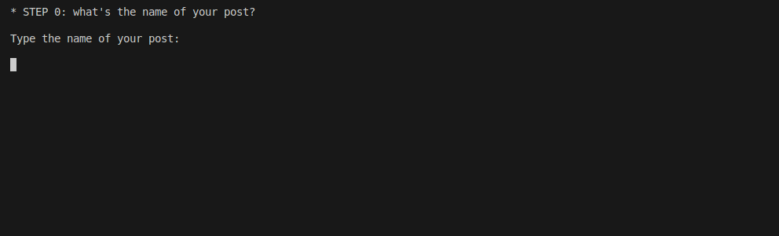

# Docs as CLI

I discovered this little gem: [Do-nothing scripting - the key to gradual automation](https://blog.danslimmon.com/2019/07/15/do-nothing-scripting-the-key-to-gradual-automation/). The idea behind the approach is deceptively simple.The basic assumption is you'll always have something called [toil](https://sre.google/sre-book/eliminating-toil/):

> Toil is the kind of work tied to running a production service that tends to be manual, repetitive, automatable, tactical, devoid of enduring value, and that scales linearly as a service grows.

Even in times of LLMs where it seems like everything can be automated with ease, in reality that's just not the case. For example, even though my weblog is still very simple I already have two rather elaborate manual procedures :

- how to add a post to the weblog
- how to redeploy (code) changes to the weblog

Just adding a post presently involved 6 steps:

- create the post in Obsidian
- copy the Obsidian Markdown post to the `weblog` repo
- convert the Markdown post to HTML
- add a table of contents to the Markdown post
- serve the post (and check if it's displayed correctly)
- commit the post to GitHub

There's no avoiding doing this. It's a weblog, I want to add posts. I'll need to have a way to add posts, either manually or an automated way. Often the first idea to get rid of the manual process is to automate everything, all at once. This rarely is a succesful approach. It takes a lot of time and most of the times you underestimate how variable the process is. Making small modifications isn't hard when going through the process manually, but can take a lot of time to properly, reliably implement. Unrelated but I also find it fun sometimes to do something and not think at all. I could also go for a walk of course.

So what else can you do when you're not automating? You can document the process. This is a big step up since know you can have a lot more confidence in what you're doing. If you have to go through a long procedure, at least you'll be confident you'll get the result you want. However, writing the documents also takes time. They'll improve over time when going through the procedure a couple of times, but still you have to make the up-front investment.

Turns out there's a way to supercharge your documents. A neat little trick: do-nothing scripting, using your documentation in a CLI. Each step in the documented process corresponds to a Python function. This function doesn't change anything itself but prints instructions. Take for example the [create_post_in_obsidian function](https://github.com/IsaacVerm/weblog/blob/0a4eeafe9aa682e714ec99bdfaa1470a38f75f3a/doc/how-to/add-post.py#L12). Creating a post in Obsidian is easy but there are some gotchas. You have to make sure there's a newline after each header, there should be a newline before starting a list, the post and the images used in the post should be kept in a specific folder, ... None of this is rocket science but you can be sure you'll not remember all of these details later on. By putting these in code, there will be no way not to be remembered of these gotchas (which is exactly what you want). Example what the code looks like:

```
def create_post_in_obsidian(post_name_kebab_case, post_name_natural):
    os.system('clear')
    print("* STEP 1: create post in Obsidian")
    print("")
    print("CHECKLIST:")
    print(f"- post is kept at /static/posts/{post_name_natural}.md (.md added automatically by Obsidian) in the Obsidian vault")
    print(f"- images are kept in the /static/images/posts/{post_name_kebab_case} folder in the Obsidian vault")
    print("- there's a newline after each header")
    print("- there's a newline before starting a list")
    print(f"- images are added as ")
    print("")
    print("Make sure to use /static and not static or the post and images won't load in the web app later on.")
    print("")
    input("Press Enter when you have created the post in Obsidian...")
```

When you run the script, it runs each function (so each step) one after another. [I tried it out myself](https://github.com/IsaacVerm/weblog/pull/6) (and [already started improving on the basic setup](https://github.com/IsaacVerm/weblog/pull/10)) and find the process a lot more lightweight and pleasant than just reading through a documented procedure. Additional advantage: it's the first step towards automation. Each step corresponds to a function. You can automate just a single function at the time. Since you know there's already some code skeleton, the energy needed to get started with the automation is way less than it would be if you'd have to start from scratch. After a while most of the critical steps will have been automated. All of this encourages an iterative approach where you keep building on your docs. This is good, the documentation should be alive.

The end result looks like this:



My first experiment was with a [how-to guide](https://diataxis.fr/) to publish a post on my `weblog`, but I can see value in using the same approach of docs as CLIs for other documentation types like references and explanations. In this way the doc/CLI can be more like a quiz.