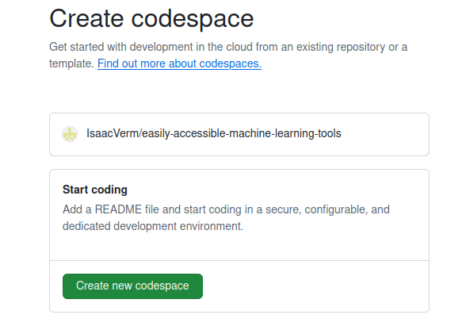
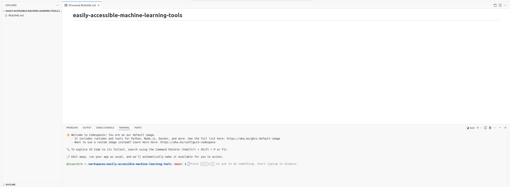
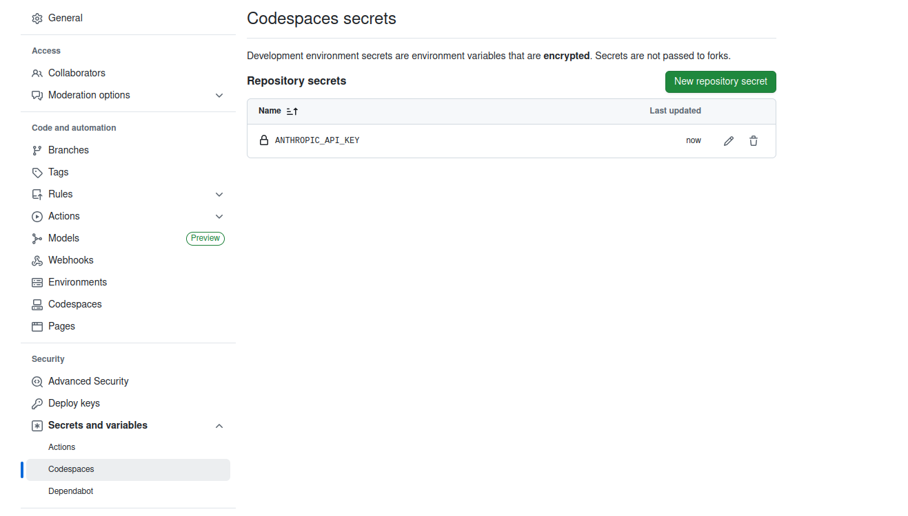
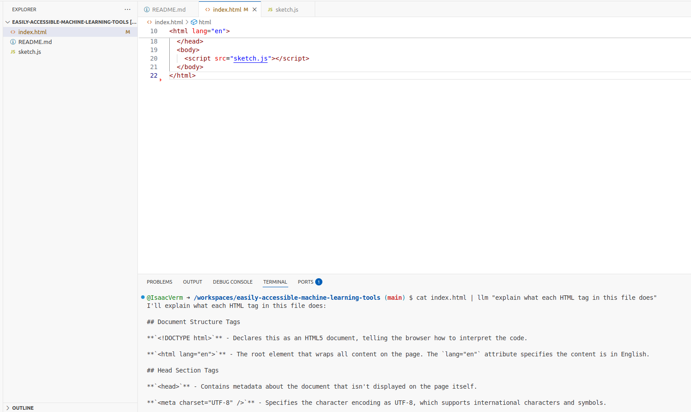

# Easily accessible machine learning tools

Overview of machine learning tools (in the broad sense of the word) which are easy to get started with.
Easy means you don't have to go through all kinds of hoops before using them.
In practice this means they're available in the browser.

Interesting tools:

- [Teachable Machine](https://teachablemachine.withgoogle.com/)
- [ml5.js (+ p5.js)](https://ml5js.org/)
- [GitHub Codespaces](https://github.com/features/codespaces)
- [Datasette llm](https://llm.datasette.io/en/stable/index.html)
- [GitHub Pages](https://pages.github.com/) (to be documented)
- [GitHub Actions](https://github.com/features/actions) (to be documented)
- [Google AI Studio](https://aistudio.google.com) (to be documented)

## Teachable Machine

Part of machine learning is training a model, another part is actually using it.
[Teachable Machine helps with training a model in an easy way](https://github.com/googlecreativelab/teachablemachine-community/):

> You train a computer to recognize your images, sounds, and poses without writing any machine learning code. Then, use your model in your own projects, sites, apps, and more.

You can create a complete model and test it in just 2 minutes. You create training image data with your webcam, train the model and instantly test it.

Although it feels like science fiction, this project might already be a bit outdated ([originally released in 2017](https://news.ycombinator.com/item?id=15399132), [GitHub version first iteration](https://github.com/googlecreativelab/teachable-machine-v1)). Should explore if there are other similar projects like Teachable Machine.

Teachable Machine models are trained completely locally. Only when you upload the model data leaves your computer.

Teachable Machine doesn't stand on it's own but is based on [TensorFlow.js](https://www.tensorflow.org/js/). The nice thing about this is your model is very close to the web.

You can [export the model and use it in your own web app](https://medium.com/@warronbebster/teachable-machine-tutorial-bananameter-4bfffa765866). For example [this is a model I made to differentiate between my hand showing one and two fingers](https://teachablemachine.withgoogle.com/models/KYiXDhDr9/).

## `ml5.js` (+ `p5.js`)

[Teachable Machine](#teachable-machine) above helps with creating a model and using `ml5.js` helps with applying the model:

- Teachable Machine is used to train a model (e.g. to classify 1 and 2 with hand gestures)
- `ml5.js` loads the model and continuously runs the classification

`p5.js` naturally fits in because it displays the results.

Just as with Teachable Machine there's no need to install anything.
`p5.js` has a web editor. [This sketch](https://editor.p5js.org/ml5/sketches/VvGXajA36) for example shows a basic setup with a model classying between daytime and nighttime.

The most important code in that sketch is the `classifyStart` function.
I think the classification is done even more than once a frame (really [continuously](https://docs.ml5js.org/#/reference/image-classifier?id=imageclassifierclassifystart)). It keeps on updating the label, but the updated label is updated only once a frame (because it's part of the `draw` function).

The [tutorial by Daniel Shiffman on using m5.js for image classification](https://thecodingtrain.com/tracks/ml5js-beginners-guide/ml5/1-classification/image-classification) is very good. In addition it's part of an excellent series of tutorials on how to use `m5.js`
Daniel Shiffman is a bit like Bob Ross. He's the guy behind [Processing](https://processing.org/tutorials) as well.

<iframe width="560" height="315" src="https://www.youtube.com/embed/pbjR20eTLVs?si=UX7C_eHqhMLhFh1a" title="YouTube video player" frameborder="0" allow="accelerometer; autoplay; clipboard-write; encrypted-media; gyroscope; picture-in-picture; web-share" referrerpolicy="strict-origin-when-cross-origin" allowfullscreen></iframe>

<iframe width="560" height="315" src="https://www.youtube.com/embed/_CpdwTcvBU8?si=hHlBvBRVPZzZJblZ" title="YouTube video player" frameborder="0" allow="accelerometer; autoplay; clipboard-write; encrypted-media; gyroscope; picture-in-picture; web-share" referrerpolicy="strict-origin-when-cross-origin" allowfullscreen></iframe>

## GitHub Codespaces

[Teachable Machine](#teachable-machine) and [m5.js](#ml5js--p5js) are used to set up a model but you also need tooling around how to manage the model.
Save the code for any web wrappers around the model, documentation about the model itself, ...
Enter [Codespaces](https://github.com/features/codespaces).
If you already have a repository on GitHub for your model, using Codespaces is just a button away:



When opening the codespace of the repository, you immediately get an editor much like VSCode in the browser:



`git` is automatically configured with `push` rights and so forth.
So there's nothing to do in terms of adding `ssh` keys or anything like that.
You can just commit and push any changes you made in the Codespace and they will be part of the repository commit history.

I wanted to work with the `p5.js` rendering of the `ml5.js` model.
For that to work you need to install the `Live Server` extension first.
`index.html` contains the HTML code and links to the `ml5.js` JavaScript code.
After installing the `Live Server` extension, you can just right-click `index.html` and open the web app.

GitHub Codespaces is [free up to a certain point](https://docs.github.com/en/billing/managing-billing-for-your-products/managing-billing-for-github-codespaces/about-billing-for-github-codespaces). You get a maximum number of hours of usage but don't have to worry about overusing it:

> If you leave your codespace running without interaction, or if you exit your codespace without explicitly stopping it, the codespace will timeout after a period of inactivity and stop running. By default, a codespace will timeout after 30 minutes of inactivity.

Starting a Codespace takes around 10 seconds, but you can use [prebuilds](https://docs.github.com/en/codespaces/prebuilding-your-codespaces/about-github-codespaces-prebuilds) to make the launching faster.

## Datasette llm

You can use the `llm` library to use LLMs in the terminal. Allows you to easily do things like this:

```bash
cat myscript.py | llm 'explain this code'
```

With a one-liner you can get explanations about your code.

The `llm` libraries plays nice with other software mentioned above like [Codespaces](#github-codespaces). You can add a secret environment variable in a repo. 
I'm using Claude by Anthrophic so I have to set up a [secret with Anthropic key](https://github.com/simonw/llm-anthropic?tab=readme-ov-file#usage).



Now when I open the Codespace of my repository, I can install `llm` and use it with Claude.
I could for example ask to explain the HTML tags used in the `index.html` file:

```bash
pip install llm
llm install llm-anthropic
llm models default anthropic/claude-sonnet-4-0
```



## Code

Code used for these research notes can be found [in the repo with the same name](https://github.com/IsaacVerm/easily-accessible-machine-learning-tools).

## CHANGELOG

- 04-06-2025: initial draft