How to use LLMs for learning a language (examples in French)
============================================================

Table of Contents
-----------------

-   Introduction
    -   Learning French is hard
    -   LLMs as tutors can help with learning the language
    -   A lot of LLM learning potential is lost
    -   Practical approach
-   LLMs don\'t stand on their own: trinity of Obsidian, Anki and LLM
    -   Obsidian
    -   Anki
    -   LLMs supercharge both apps
-   How I\'ve been using the Claude LLM when learning French
    -   Ask to explain a grammatical concept
    -   Ask why a specific form of a word is used
    -   Partial translation
    -   Quickly generate a lot of customized examples
    -   Help with creating hints for words in Anki flashcards
    -   Turn facts into questions
    -   Use LLM as translator
    -   Ask for equivalent expression in different language
-   How do these practical examples relate to the bigger picture?
    -   Data becomes fluid
    -   Iteration becomes inexpensive
    -   Because of the decrease in friction new opportunities open up
    -   Democratization of skills
    -   LLM becomes a tutor
    -   Less friction is more fun
-   Conclusion

Introduction
------------

### Learning French is hard

I started really learning French a couple of years ago. I did learn
French in school but only really picked it up at work. Over the years
I\'ve always kept at it, but not always at the same intensity. What made
it hard to keep practicing consistently was I never really managed to
integrate French into a more structured learning process. Some
structured way of learning the language with visible progress.

### LLMs as tutors can help with learning the language

So I was still thinking about this when in 2022 Large Language Models
(LLMs) became mainstream. After a while I started experimenting with
them a bit. If you don\'t know what an LLM is, you probably do know
ChatGPT. ChatGPT is the application wrapping the OpenAI LLM. Other LLMs
exist as well: you have large closed-source models like
[Claude](https://www.anthropic.com/claude) but also open-source models
ran locally in [Ollama](https://ollama.com/).

At first I just used these LLMs for coding, mainly using [GitHub
Copilot](https://github.com/features/copilot). After a while I started
branching out, using them to do research and basic data cleaning tasks
but still I didn\'t use them for anything related to learning French.
The trigger for me to give LLMs a try to learn French came when I
(re)read [Why we stopped making
Einsteins](https://www.theintrinsicperspective.com/p/why-we-stopped-making-einsteins).
The article doesn\'t speak about LLMs directly, but talks about how
having a personalised tutor in the past could help students enormously.
To me the link to LLMs is clear. LLMs can act as artificial tutors, but
in contrast to tutors in the 18th century they\'re accessible to
everyone. Of course they don\'t replace real tutors, but when you don\'t
have access to a real tutor they could still be very useful. This
personalised form of learning seems to help enormously.

### A lot of LLM learning potential is lost

When talking about this with other people, I noticed there\'s a lot of
hesitance and people are doubtful about the idea of LLMs as tutors being
something worth pursuing. In this way it seems clear the main obstacles
to unlocking LLMs as a learning tool are societal, not technological.
That\'s about the same way the previous technological revolution, the
internet, was received. A good example can be found in the introduction
of the Einstein article:

> I think the most depressing fact about humanity is that during the
> 2000s most of the world was handed essentially free access to the
> entirety of knowledge and that *didn\'t* trigger a golden age.

I feel like something similar is happening with LLMs now. We now have
access to an extreme powerful tool but somehow society doesn\'t manage
to exploit it to its full potential. We\'re still stuck at the stage of
using ChatGPT to write very average summaries, but these LLMs can do so
much more. Their usefulness isn\'t in the tool itself but how you
you/society uses it.

### Practical approach

In order to see if my theory of LLMs as tutors holds up, I decided to
have another go at learning French, but this time LLM-assisted. A large
part of the rest of this post will consist of me showing examples of how
I leveraged the LLM to improve the learning process. Using examples I
want to keep things grounded, avoiding making wild claims saying LLMs
are either the end of the world or some kind of superintelligence.

I\'m not claiming my approach of using LLMs would work for anyone, but I
can say they do work for me. I\'m really convinced having the LLM made
learning French easier. You still have to do the work yourself, but a
lot of hurdles making it hard to get started or get the right
information are no longer there.

I didn\'t do this in a vacuum. I got a lot of inspiration from other
people\'s writing on the same subjects, mainly [Simon
Willison](https://simonwillison.net/) and [Nicholas
Carlini](https://nicholas.carlini.com/). Simon Willison\'s site has a
lot of entries, detailing both what worked for him and what didn\'t. The
format of this article itself is heavily inspired by [How I use
AI](https://nicholas.carlini.com/writing/2024/how-i-use-ai.html), an
article by Carlini. I liked his practical way of writing and tried to do
something similar. At first I added a section detailing all the benefits
of using LLMs but I ditched that part completely. I hope the examples
speak for themselves. I think the best way to get my point is across is
to explain what I did with examples and explain the approach taken. The
most important part of using these examples is they\'re real. It\'s not
some marketing pitch. You can check the results yourself, experiment and
see what you make of it.

I don\'t claim any originality in writing this article. I hope the added
value of having another article showing LLM practical examples, is it
makes clear you don\'t have to be a genius to be able to take advantage
of what LLMs offer. Carlini works at Google DeepMind, I don\'t and we
work on a completely different level but still both of us get some value
out of using LLMs. That\'s something. Next to these lofty aspirations, I
also just wanted to take the time to write down what I learned on the
topic. Without the format of a blog post I\'d probably never get around
to doing it. It certainly helped clear my mind on the topic. This is
inspired by [Andy Matuschak\'s work with the garage door
up](https://notes.andymatuschak.org/Work_with_the_garage_door_up)
article. I want to be able to share these small projects and a blog post
seems like the best format to do that.

At the end of the article I\'ll take things a bit further, moving beyond
just the examples and I\'ll go over what lessons can be learned from
these examples. This combination of practically getting in touch with
reality and at the same time thinking about what exactly you\'re doing
and how it fits the bigger whole yields the best results in my opinion.
It is the most interesting approach for yourself as well. Not sterile
but lively.

Repeating myself, but the point I really want to get across is LLMs
already are very useful (they certainly are to me) and I\'d be surprised
they wouldn\'t be useful to a lot of other people as well. I completely
agree with how Nicholas Carlini articulates it in [How I use
AI](https://nicholas.carlini.com/writing/2024/how-i-use-ai.html):

> So when people say things like \"LLMs are just hype\" and that all LLM
> provide no tangible value to anyone, it\'s obvious to me they are just
> wrong, because they provide *me* value. Now maybe I\'m the exception.
> Maybe I\'m the only one who\'s found a way to make these models
> useful. I can only speak for myself. But given that LLMs can
> significantly improve *my* productivity\-\--someone who has been
> programming for 20 years before ever using a LLM\-\--I suspect that
> there are other people out there who could benefit from them as well.
>
> But there seem to be a (large?) contingent of people out there\-\--in
> the academic literature, in the software engineering space, and also
> in the media sphere\-\--who proclaim widely that LLMs contribute
> nothing, are just another hype cycle, and in a few years will die
> having had no impact on the world. I will be arguing these people are
> wrong because current LLMs are already useful.

There\'s certainly a lot of marketing and hype around everything LLM.
But in my opinion they\'re here to stay so better experiment with them.
You can see for yourself what\'s true and what isn\'t. Experiment and
read up because there\'s a lot happening (which is good). Before moving
on to the main part showing some concrete examples how LLMs can be used
when learning a language, I\'ll first make a small detour. This detour
is necessary to fully understand the value LLMs offer as part of a wider
ecosystem of applications.

LLMs don\'t stand on their own: trinity of Obsidian, Anki and LLM
-----------------------------------------------------------------

### Obsidian

I\'ve been a longtime user of both Obsidian and Anki. Obsidian is a
note-taking app. Notes are just Markdown files but Obsidian makes them
more useful by offering plugins to manage them (for example
[Dataview](https://blacksmithgu.github.io/obsidian-dataview/) to turn
your notes into a lightweight database) and focus on creating links
between notes. It helps me keep projects structured. Whenever I\'m
researching something or come across interesting links, articles,\... I
can add these to my Obsidian structure. This way I can still find notes
back, even months or years later.

### Anki

Anki is a flashcard app. Using [spaced
repetition](http://augmentingcognition.com/ltm.html) it helps you
remember things for the long term. In a way this is the same goal as I
have for my notes in Obsidian. I note them down because I don\'t want to
forget about them. I create flashcard apps in Anki because I don\'t want
to forget about them. So Obsidian and Anki are already a natural fit.
When I research a new topic, I first start creating notes and a
structure for these notes in Obsidian. After a while I review the topic
and select what\'s most important. What\'s most important is turned into
Anki flashcards. I\'ve experimented with other approaches but these
didn\'t work because understanding must come before memorizing. It\'s no
accident this is the first rule of the well-known Piotr Wozniak article
about formulating
[knowledge](https://super-memory.com/articles/20rules.htm).

### LLMs supercharge both apps

All this talk about Obsidian and Anki seems far removed from LLMs, the
main topic of this article. But it\'s not. One thing I discovered while
studying French is how important it is to work with source material you
yourself find interesting. Text books contain a lot of generic material.
Talking about elephants, non-sensical dialogues, \... That just doesn\'t
stick. This is a place where LLMs can really help out. The power of LLMs
lies in customization. For example I\'m into chess and anything related
to chess will grab my attention. At the same time I want to learn some
French. With LLMs combining those two is trivial. Look at the contrast
between the two examples below. Both take the same amount of time to
make but the results of the chess prompt are way more useful.

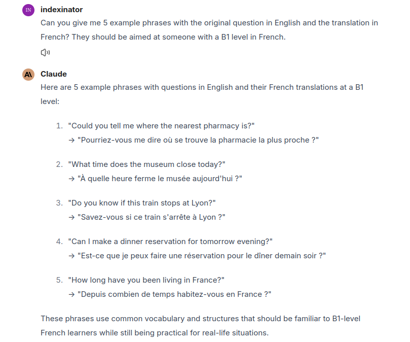
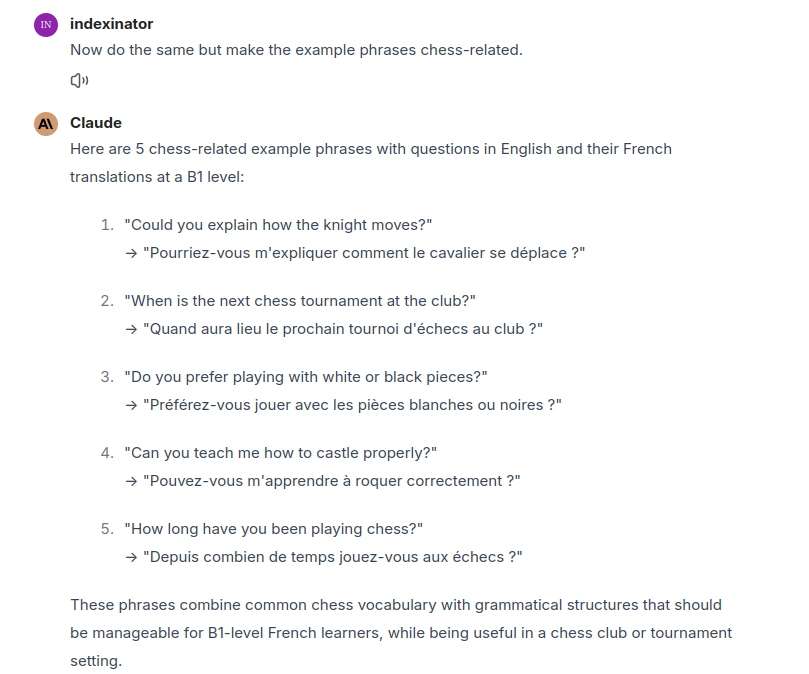

By using Obsidian you can take it even further. For example I can use
articles I\'ve added to my notes as inspiration for the LLM to take
vocabulary from. I don\'t have to learn all French words, I only want to
learn those words related to topics which interest me. And by definition
my Obsidian vault only contains notes about topics I\'m interested. If
they wouldn\'t interest me, I wouldn\'t have taken the time to turn them
into notes.

LLMs are good at changing data from one format to another and this helps
a lot with making questions based on information I already have in my
Obsidian notes. For example, I\'ve got some list with favorite books and
films. I can turn these lists into suitable Anki flashcards.

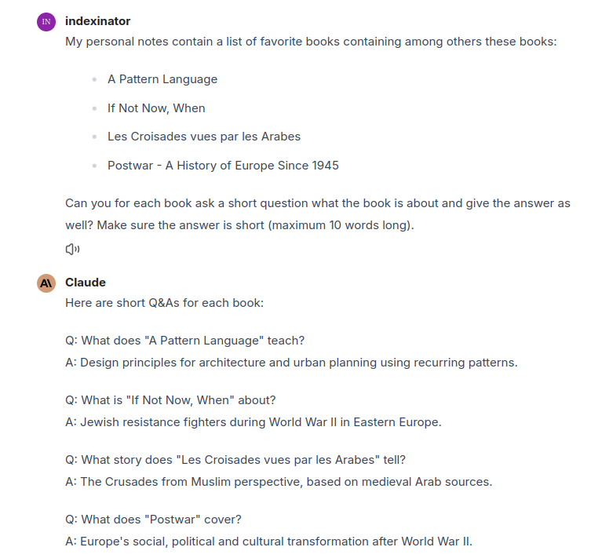

If I want to use these questions to learn French now, I should just ask
the LLM to translate them. Answering these questions in Anki will be a
lot easier than answering other questions in French, because I already
know a lot of context because they\'re based on notes I\'ve written
myself.

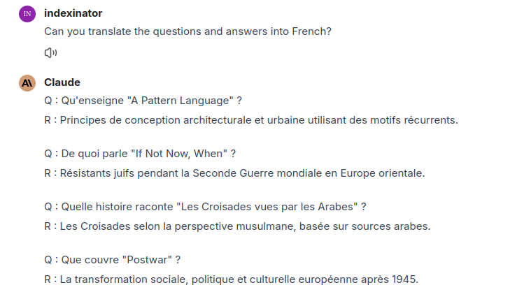

How I\'ve been using the Claude LLM when learning French
--------------------------------------------------------

In the part above I already showed some examples how I\'ve been using
LLMs with learning French. In what follows I\'ll show some more
examples, showing how an LLM can be used in a variety of ways.

### Ask to explain a grammatical concept

Say I\'m a complete beginner at French and I don\'t know anything about
how verbs in French work. You can ask the LLM to give you a quick
introduction to this topic.

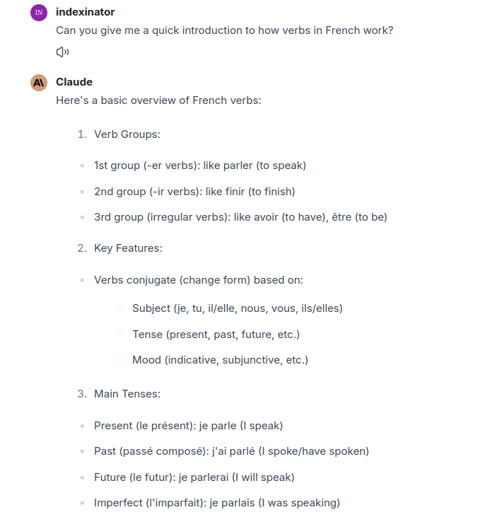

This introduction of a concept can be customized in the prompt as well.
For example, you can make the link with a language you\'re already
familiar with. This gives you some grounding and helps you put the
concepts explained into context.

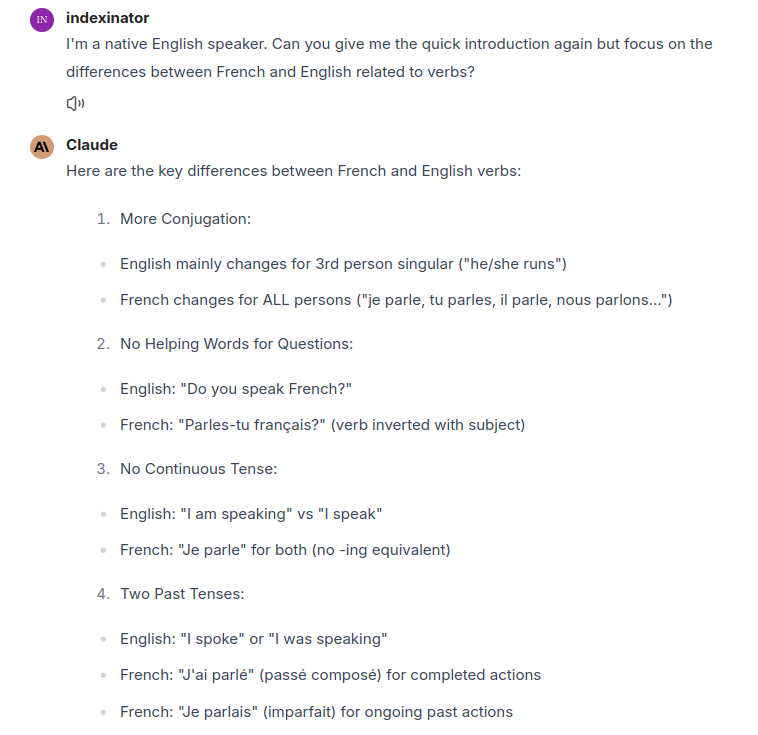

Since I know a bit of French already I can make the call these
differences are really differences between French and English and not
just minor details. Of course absolute beginners can\'t make this call,
but this doesn\'t pose too much of a problem. What you\'re asking for is
very basic (an introduction to a very basic concept in a widely spoken
language). You can be reasonably sure the output will be good enough.

Even if there are mistakes, it\'s a starting point. You can do your own
research. If later on you notice there was a mistake in the LLM output,
this might actually be beneficial. I noted several times already
correcting these mistakes helps a lot with memorizing. Probably because
it\'s something active to do. In a way these mistakes are a boost to the
language learning process.

### Ask why a specific word is used

Often you read something and you\'re not sure exactly why a word is
used. Why not some other verb? Why does the word end in these letters?
You can just ask the LLM to explain.

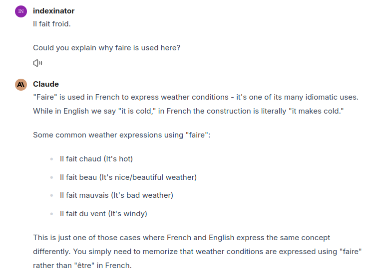

This approach works well in combination with Anki. You can imagine
multiple types of questions:

-   just reusing the same question:
    -   Q: Which verb to use when you talk about the weather?
    -   A: faire
-   shortening the question:
    -   Q: weather + {verb}
    -   A: faire

### Partial translation

A good example of partial translation is [the Metro book series turned
into a
game](https://play.textadventures.co.uk/Play.aspx?id=ubqglkk1j0m5bzdeolih9a). [Opinions
differ on whether this is a good
idea](https://www.reddit.com/r/languagelearning/comments/16mlg02/language_learning_app_using_partial_translation/)
but I found translating some words to French in a text while keeping
other words in the original language (English in my case) to be quite an
enjoyable way of immersing myself in French without overburdening
myself. You ask the LLM to only translate some words in the English
input text. You can be pretty specific about what you want translated
and what not: only translate difficult (long) words, only translate
words related to a specific theme,\... Or alternate between foreign and
native words.

This works well if you know what to expect. Either you already read the
book in English or the context makes clear what to expect. You do need
to do some prompt engineering though to make it work, but not a lot. For
example, if you just ask the LLM to alternate without providing context
why, it will provide both the French translation but also the original
English word which spoils the effect:

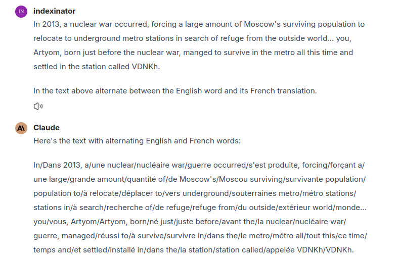

By providing an example how the alternating text should be formatted and
what makes a good candidate for translation, the results are instantly a
lot better. To the point I don\'t think it\'s a lot worse than the Metro
text adventure. I assume in that game it was done manually since the
game was released long before LLMs became mainstream.

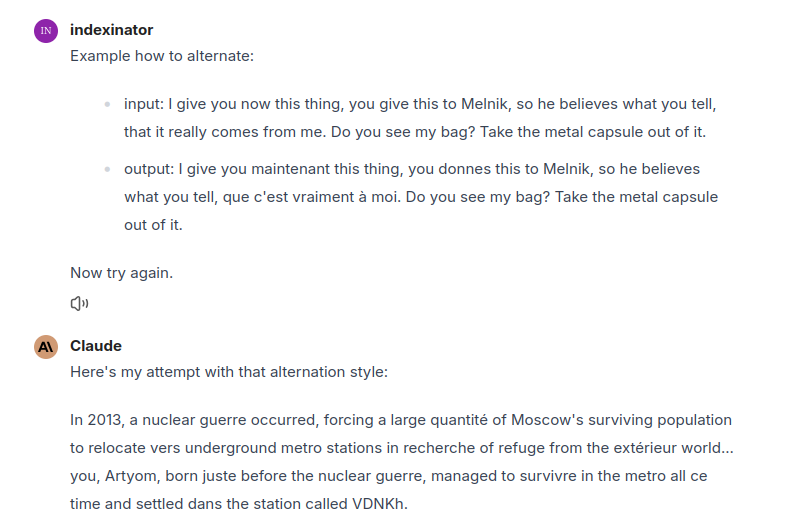

I didn\'t ask for the reason why these words exactly were translated,
but the LLM provided it by himself. You could ask to list the reason why
each word was translated for testing purposes:

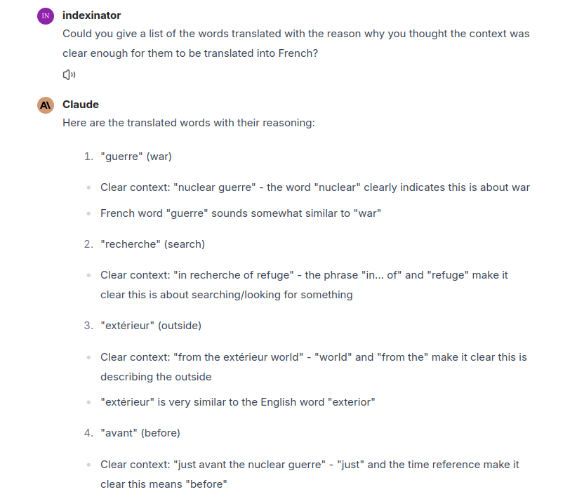

This information you can use once more to iterate on your prompt. You
could for example tell the LLM to only translate if a word is part of a
phrase. An example of this was how \"in search of\" was translated into
\"in recherche off\". This is a standard theme with LLMs. You first try
out a very general prompt and see in what way the output differs from
what you want. Based on this output you iterate and bit by bit the
result moves in the direction you want.

I had somewhat forgotten about this partial translation approach, but
now I rediscovered it I remember why I like so much. It\'s very nice to
be able to read a book in a language you\'re not all too familiar with
without having to look up the meaning of each word.

### Quickly generate a lot of customized examples

Whether you\'re focusing on grammar or vocabulary, you learn best by
example. Using LLMs it\'s easy to create a lot of targeted examples. Say
I\'m learning about verb conjugations. It\'s natural to want to know
what these conjugations look like.

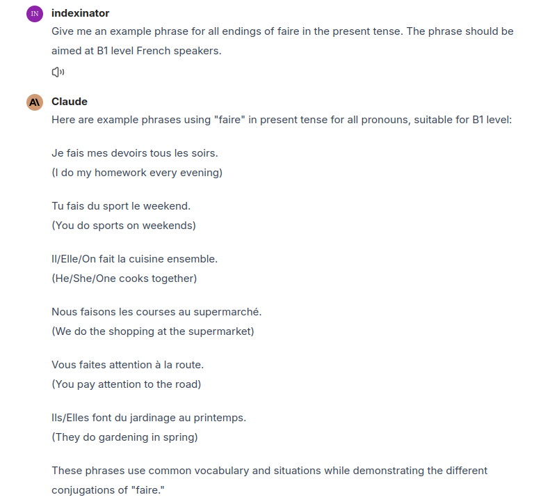

Anything you can think of can be customized: the difficulty level, the
theme, \... You just have to ask for it.

### Help with creating hints for words in Anki flashcards

It\'s well known French words can be quite long. For example \"law\" (3
letters) can be translated as \"législation\" (11 letters) in French.
That\'s quite daunting if French isn\'t your native language. Adding
these words as flashcards in Anki makes for a very steep learning curve.
It would help if I could add some hint to the question, for example the
word split into syllables. In itself this isn\'t hard to do. But it\'s
rather boring and annoying to do. The solution is just a prompt away (in
the process showing another example of how easy it is to generate
examples):

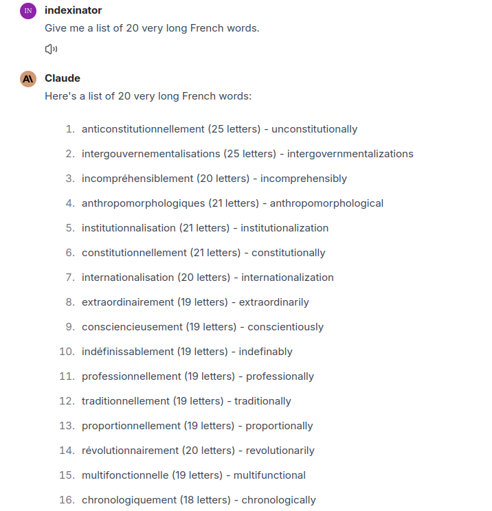

You can be ambitious and not limit yourself to syllables and try
something more ambitious like splitting the word in its constituent
parts.

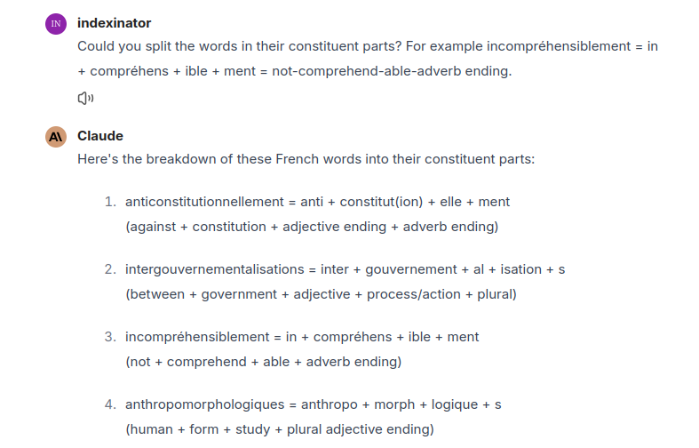

Talk about LLMs often is about some kind of superintelligence but the
way I use it, it\'s more like a tool making common tasks scalable. If
I\'d have to cut 200 words into syllables I\'d find it boring, it\'d
take a lot of time so I\'d probably abandon the project before even
trying. But if I can just ask the LLM to do it, all of a sudden the
realm of possible projects expands a lot. This is a common theme with
LLMs: projects previously unfeasible become feasible now.

### Turn facts into questions

My Obsidian vault contains a lot of notes but all of these are facts.
The format Anki uses are questions. I could manually translate these
facts to questions which takes time. Or I could let the LLM do it. The
higher the quality of the input information, the better this works.

For example, after the release of Gladiator II I was interested in how
historically accurate the film really is and stumbled upon this
[scathing
critique](https://acoup.blog/2024/12/06/collections-nitpicking-gladiator-ii-part-i/).
It contains entries like this:

> But that\'s not the biggest timeline problem! Instead, the biggest
> timeline problem is that it is the third century AD and we are
> attacking Numidia. \... Which is to say, by 200 A.D., the earliest of
> the multitude of possible dates for this film (which mashes together
> events from 211 to 218), Numidia has been a Roman province
> *two-hundred and fifty years*. By this point, North Africa, far from
> being some foreign \'barbarian\' land is distinctly Roman.

If I ask the LLM to think of some questions based on that input I get
this:

All of a sudden the data is in a format usable to Anki.

### Use LLM as translator

Sometimes you can keep it even more basic. Using LLMs, you don\'t need a
separate translation app but can just prompt to translate some input
text. Any Anki cards I already have can easily be translated into
French.

### Ask for equivalent expression in different language

If expressions go way back, to Latin or Greek expressions, the mapping
of the words between languages is often one-to-one making translating
easy and easy to remember as well. Idea inspired by [Translation as a
language learning method - why and
how](https://howtogetfluent.com/translation-as-a-language-learning-method/),
an article focusing on the benefits and drawbacks of translation as a
learning tool.

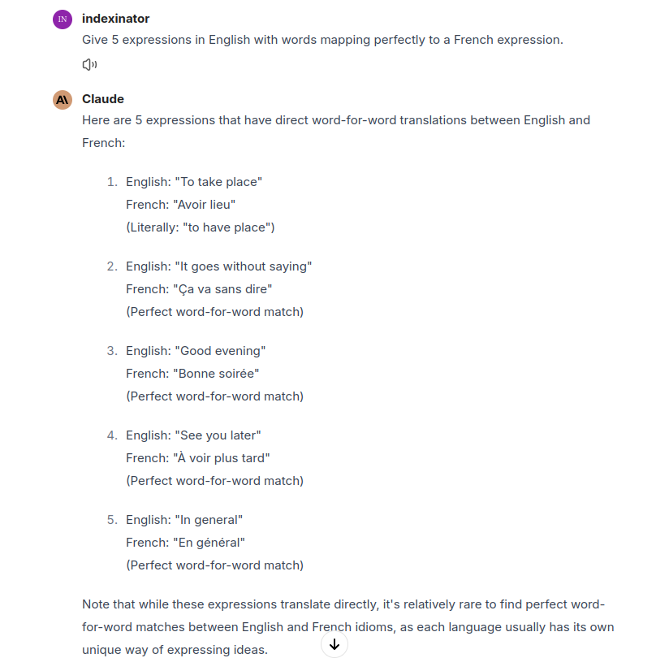

How do these practical examples relate to the bigger picture?
-------------------------------------------------------------

The examples above are very concrete, but they often point to larger
developments.

### Data becomes fluid

In a lot of the examples above, the basic pattern consisted of changing
text from one format to another. For example turning phrases into
questions. If you\'d want to you can turn these questions back into
phrases as well. It\'s no longer so clear what type of data you\'re
dealing with. And maybe it matters less than it used to. I\'m not the
first one to notice this:

[LLMs and information
post-scarcity:](https://newsletter.squishy.computer/p/llms-and-information-post-scarcity)

> Content has become like clay. LLMs can remix it, summarize it,
> elaborate on it, hallucinate it, combine it with other content, freely
> transform it between text, audio, image, and back again. It seems we
> have achieved a kind of information post-scarcity. A regime of radical
> overproduction. A content singularity. How will this change things?

### Iteration becomes inexpensive

It\'s easy to get a quick prototype of an idea off the ground. You try
out something and see if the result is somewhat in the right direction.
Most of the times there are issues with the output format or all of a
sudden you realise what you\'re asking for isn\'t really what you want.
After a couple of iterations, you get something working. If you notice
you keep using this prototype, you can turn it into a more permanent
project using code.

### Because of the decrease in friction new opportunities open up

[How I Use
\"AI\":](https://nicholas.carlini.com/writing/2024/how-i-use-ai.html)

> In fact, I can confidently say that I probably just wouldn\'t have
> made this quiz if I didn\'t have access to a language model to help
> me\-\--because I was uninterested in spending time writing the entire
> web application from scratch. And I\'m someone who knows how to
> program!

There are things I don\'t want to spend time on like splitting hundreds
of words in syllables. It takes a lot of time and the payoff is only
marginal. However, with LLMs the effort required decreases drastically
so all of a sudden this marginal payoff is bigger than the effort
invested and splitting hundreds of words in syllables actually becomes a
valuable activity.

[How I Use
\"AI\":](https://nicholas.carlini.com/writing/2024/how-i-use-ai.html)

> There are two kinds of programs. First, you have programs that you
> want to do \_right\_; they\'ll be around for a while and the
> cleanliness matters because you\'ll have to maintain it for several
> years. Then you have the programs that wil exist for all of 25
> seconds; they\'ll help you complete some task, and then be immediately
> discarded. In these cases, where I don\'t care at all about the
> quality of the code, and the programs are entirely self-contained, I
> now almost exclusively use LLMs to write them for me.

Still disappearance of friction has a lot of consequences. There\'s the
danger of your programs just staying prototypes and never moving on to a
more structured level. If I\'d just use the examples as described above
without going any further, I\'d miss out on a lot of value. But these
examples did give me a chance to see what works well and what I find
useful.

For example I love creating custom examples. Having these turned into
Anki questions single-handedly made me use the Anki application a lot
more. But in the current process there\'s still a lot of friction: I\'ve
got to put the prompt in [LibreChat](https://www.librechat.ai/), check
if the results are allright and copy the results into Anki. In itself
all of these tasks are \"solved\", but each task still takes a bit of
time. I know from experience it\'s this part which might make you give
up.

The idea is to formalize this creation of examples into a programmed
pipeline. At that time the examples are pushed into Anki everyday and
all I have to do is open the Anki app in the morning. The crucial
insight is I wouldn\'t have started on this pipeline without having seen
the working prototype first. Writing the pipeline (even assisted by an
LLM) still takes quite some time and you only want to do this if you
know beforehand the time investment will be worth it.

### Democratization of skills

[How I Use
\"AI\":](https://nicholas.carlini.com/writing/2024/how-i-use-ai.html)

> I believe that even current models are largely sufficient to allow the
> vast majority of people to solve meaningful tasks they could never
> have solved before just by asking for the solution.

A lot of the tasks detailed above in the past would have required at
least some coding knowledge. If I would have wanted to split words in
syllables, I would have needed to program a way how to do this or find
some code capable of doing this exactly the way I need. Most of the
tasks are
[NLP-related](https://en.wikipedia.org/wiki/Natural_language_processing)
so a lot of [regular
expressions](https://en.wikipedia.org/wiki/Regular_expression) would
have been needed. Maybe you could have used a Python package like
[spaCy](https://spacy.io/) but it would still have been a reasonably
time-intensive task and even for someone proficient at programming NLP
tasks it would have taken quite some time to implement. Enough time in
order not to be able to iterate on the solution. But by simply asking
the LLM to do it for you, you avoid having to know how to code. This
doesn\'t mean programming is a thing of the past because LLMs are
notoriously non-deterministic, so if you want to have some guardrails
and consistency you\'ll still have to know how to program. But for
prototyping there\'s nothing better.

The [spaCy package](https://spacy.io/usage/large-language-models) itself
describes it best:

> Supervised learning is much worse than LLM prompting for prototyping,
> but for many tasks it\'s much better for production. A transformer
> model that runs comfortably on a single GPU is extremely powerful, and
> it\'s likely to be a better choice for any task for which you have a
> well-defined output. You train the model with anything from a few
> hundred to a few thousand labelled examples, and it will learn to do
> exactly that. Efficiency, reliability and control are all better with
> supervised learning, and accuracy will generally be higher than LLM
> prompting as well.

### LLM becomes a tutor

This goes back to the original starting point of this article.

[How I Use
\"AI\":](https://nicholas.carlini.com/writing/2024/how-i-use-ai.html)

> This means that instead of reading some static tutorials on how to get
> started, which assume a particular reader who knows specific things
> and who wants to achieve some particular goals, I can work
> interactively with a language model to learn whatever I need to solve
> my task.

If I ask the LLM to explain a grammar concept using custom examples,
this is exactly what I\'m doing.

### Less friction is more fun

There\'s a lot less friction. In itself it doesn\'t seem like that would
matter a lot. Say I need a few examples of a grammatical concept. I
could ask the LLM, but I could also just open a textbook and look. So
what\'s the difference? Once you try to do this once with an LLM, you
instantly notice this does change a lot. It feels different, more
pleasant and fluid in a way.

Aside from this, all the friction adds up quickly as well. In a best
case scenario you find what you need right away. But this hardly ever is
the reality. Maybe you don\'t really know where to look. Or the concept
is related to several other concepts and the examples you want just
don\'t exist. You can easily spend an hour chasing down those examples.

[How I Use
\"AI\":](https://nicholas.carlini.com/writing/2024/how-i-use-ai.html)

> When I show some people these examples they get kind of defensive and
> say "The LLM hasn\'t done anything you couldn\'t have done with the
> tools you already had!" And you know what? They\'re right. But
> there\'s nothing you couldn\'t do with the search engine you couldn\'t
> have done with a physical book on the topic, and there\'s nothing you
> couldn\'t have done with a physical book that you couldn\'t have done
> by reading the source code. But each of these, in turn, is easier than
> the last. And when something is easier, you do it more often and in
> qualitatively different ways.

Conclusion
----------

LLMs are here to stay and I think the advantages they bring should be
clear to anyone. They were clear to me when experimenting with using an
LLM to make learning French easier, and they seem clear to people way
more knowledgable on them than me like [Nicholas
Carlini](https://nicholas.carlini.com/writing) and [Simon
Willison](https://simonwillison.net/). Even if you\'re not convinced by
the examples I\'ve shown, give it a try for yourself. You don\'t even
need a monthly subscription. You can just use the API of a major
provider like Anthropic with [Claude](https://www.anthropic.com/claude)
and run a UI wrapper like [LibreChat](https://www.librechat.ai/) (which
I\'m using myself but any UI wrapper would do). Or run the LLM locally
yourself with [Ollama](https://ollama.com/) for example (you do need
some patience though if you don\'t have a cutting-edge computer,
although the requirements you often see online often seem exaggerated).
It\'s always good to go back to the original source and don\'t blindly
trust what others say about any topic. To find out for yourself what\'s
hype and what\'s not.

Experiment with LLMs and apply them to whatever topic interests you
most. It\'s crazy people still say (as you often hear): \"Oh I can\'t do
that. I would have to follow a course to first get to know more about
this topic before I start doing something.\". I strongly believe this is
the wrong approach. People should be more like Bob Dylan and just keep
going at it. Somehow something will always pop up. Not everything will
turn out great, but it\'s guaranteed you\'ll have learned something.
