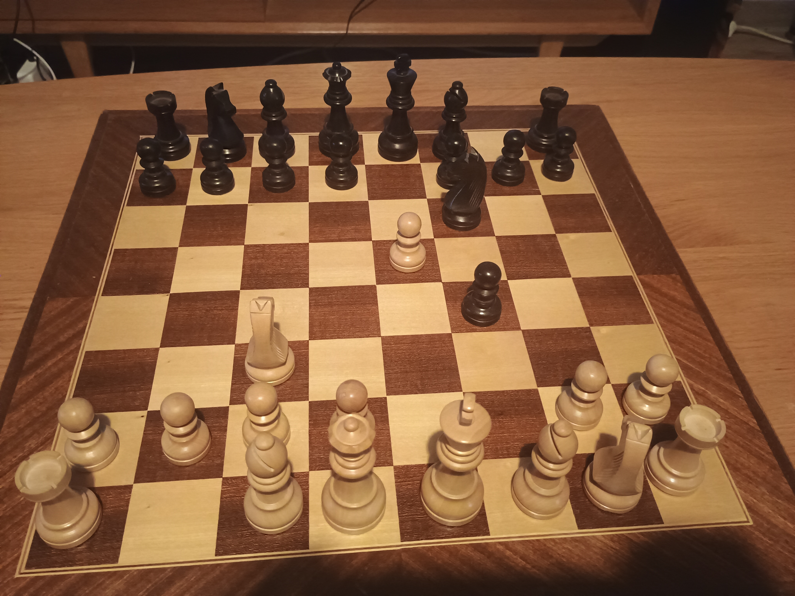
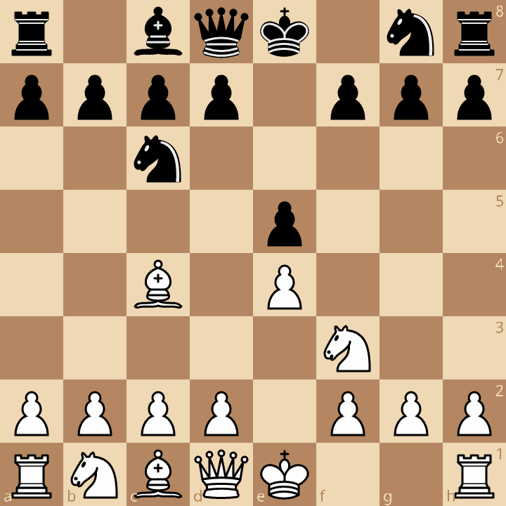

# Prompting LLM with images chess positions physical board

For quite some time I have been thinking how cool it would be to have a physical chess board setup digitizing the moves. You could play moves and the moves will be registered so you can analyse the game on your computer later on. Apparently [boards like that already exist](https://digitalgametechnology.com/products/home-use-e-boards), but they're quite pricy and if I check the [reviews](https://www.reddit.com/r/chess/comments/s583d7/dgt_pegasus_board_review/) I'm not that convinced they work all that well.

I've been using the [llm utility of Datasette](https://llm.datasette.io/en/stable/) a lot and noticed there's an option to add images to the prompt. This way I could just ask the LLM to translate a picture of a chessboard to [FEN](https://en.wikipedia.org/wiki/Forsyth%E2%80%93Edwards_Notation) (notation for chess positions). Based on previous positive results, I expected this to work out quite well.

Take for example this position resulting from the [Vienna Gambit](https://lichess.org/opening/Vienna_Game_Vienna_Gambit/e4_e5_Nc3_Nf6_f4_exf4_e5):



I prompt Claude 3.7 Sonnet to get the FEN of this position:

```bash
llm "give the FEN notation of this position" -a chessboard-4.jpg
```

The resulting FEN, `r1bqk1nr/pppp1ppp/2n5/4p3/2B1P3/5N2/PPPP1PPP/RNBQK2R`, is completely off the mark:



Not a single piece is in its right place. It's clear using images with an LLM is different than using text. I'm definitely [not the only one getting disappointing results](https://medium.com/@gyardley/chess-claude-3-5-sonnet-d05cc57e00c1). However, I do see plenty of possibilities to experiment though:

- Take pictures of the board from different angles. Now I went for a 45 degree angle, but maybe other options are better.
- I could for example take a picture from straight above with perfect lightning and provide the LLM with a mapping between how each piece looks from above and the name of the piece.
- I used Claude Sonnet 3.7. Maybe other models are better suited for this task.

Something I already experimented with is giving the model some additional context about the position. If I'd use it in a real-life application, I'd already have the FEN of the position just before. I could give this FEN to the model with the image and ask it to give the FEN of the position in the image:

```bash
llm "Give the FEN notation of this position. The previous position was rnbqkb1r/pppp1ppp/5n2/8/4Pp2/2N5/PPPP2PP/R1BQKBNR w KQkq - 0 4 and now it's White's turn to play." -a chessboard-4.jpg
```

This doesn't seem to improve anything, the result still is really off:


In a way this is to be expected, even [way more rigorous research](https://github.com/notnil/fenify-3D?tab=readme-ov-file#prediction-visualization) cites a very low accuracy rate: models can get a lot of squares right (62 or 63 out of all 64 squares) but any model which doesn't have perfect accuracy isn't really usable in practice. It seems you only get at [15% of board recognition](https://repository.tudelft.nl/record/uuid:5453c9dd-6a9b-4443-a4cf-c6b9db2f4c10).  I assume this number is inflated as well: the model will probably handle early game positions way better than late game positions since there are just way more examples of those.

A different approach would be to make sure the physical chess pieces resemble digital pieces. This problem is as good as solved (for example by [Chessvision.ai](https://chessvision.ai/)).

## CHANGELOG

- 22-03-2025: initial draft