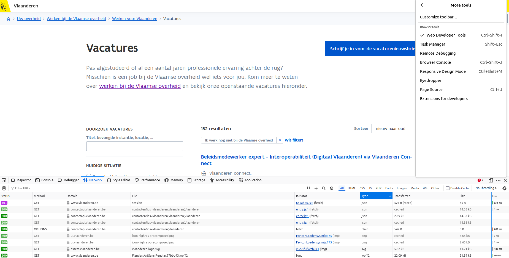
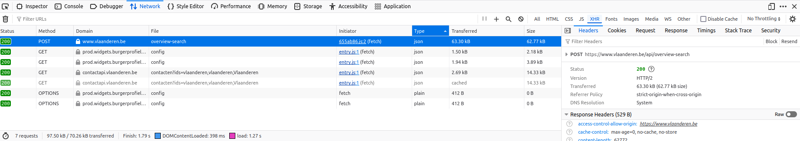
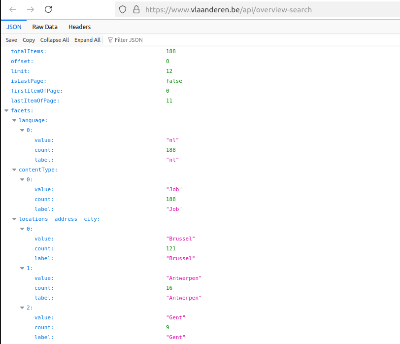
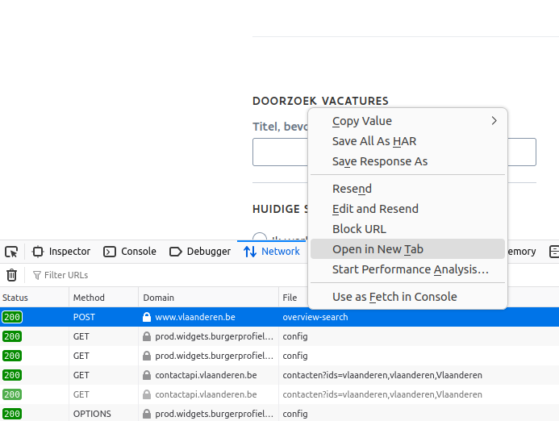
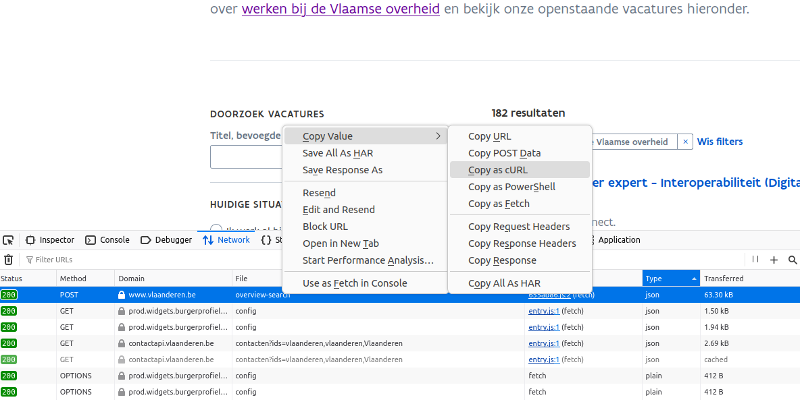
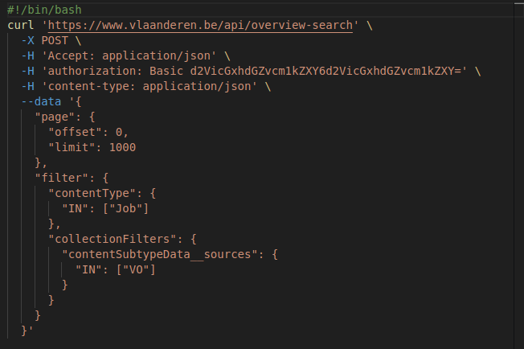
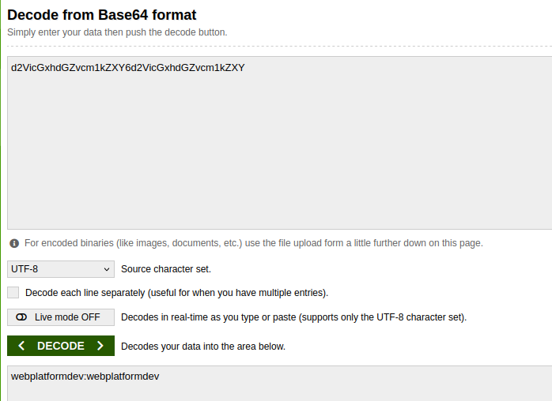
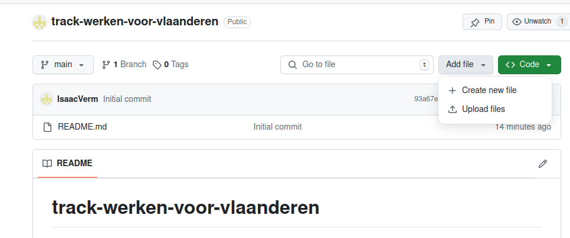
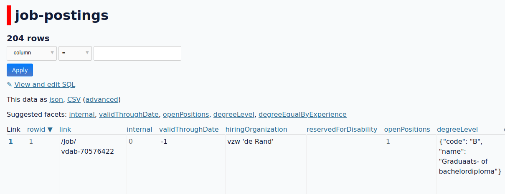

# Tracking job postings Flemish government using GitHub Actions

## Introduction

Recently I discovered a new technique to scrape data thanks to the [Git scraping - track changes over time by scraping to a Git repository](https://simonwillison.net/2020/Oct/9/git-scraping/) article (make sure to check out the [live demo](https://www.youtube.com/watch?v=2CjA-03yK8I), it contains more or less the same info as the article but it's impressive to see how much scraping work you can get done in just a couple of minutes). The basic idea behind the article is to leverage [GitHub Actions](https://github.com/features/actions) and GitHub itself to track changes to data over time.

Using GitHub Actions opens a lot of possibilities: you don't need to set up your own infrastructure and you can take care of everything GitHub already offers in terms of version control (to track how data changed over time).  Also you don't need a lot of code to set this up: just a configuration file in `.github/workflows` (which you can even do in the browser itself) and the scraper can run. The end result is a commit on GitHub for each change in the data. You can set up GitHub Actions to run regularly so you don't have to think about any scheduling anymore. The added value over just downloading the data once is you have information about the changes. When talking about job postings this is rather interesting because a posting might get updated and it's interesting why and when this happened.

Before I was writing another post on the same topic (instead of scraping job postings I was scraping [Subsidieregister](https://subsidieregister.vlaanderen.be), a site detailing subsidies granted by the government) but got bogged down. I ran into some issues which were not impossible to solve, but made the whole idea a lot less attractive (more on that later). The key thing I realized is the process of scraping has to be as simple as possible. When a data source is hard to get hold of, you should first think whether the data is actually worth it before going into problem solving mode.

What's different between tracking the job postings of the Flemish government and tracking Subsidieregister?

- the job postings site uses an API you can use (not documented officialy but easy to find and structured, more on that later) instead of having to scrape the pages
- there's no [geo-blocking](https://en.wikipedia.org/wiki/Geo-blocking) as there is for Subsidieregister so you can't use the default GitHub Actions runner

Both of these differences are entirely solvable, but make the whole process a lot less lightweight. In the rest of the article I'll go through the concrete steps it takes to set up scraping of the Flemish governement job postings. 

## Setting up the scraper

### Preliminary check there's no geo-blocking

When trying to scrape Subsidieregister using GitHub Actions I discovered this isn't possible using the default [GitHub-hosted runner](https://docs.github.com/en/actions/using-github-hosted-runners/using-github-hosted-runners). I assume because it's located in the US because when I select the US as country in my VPN, I can no longer access the site while I can access it when no VPN is enabled. Luckily this wasn't a problem when scraping the job postings on [Werken voor Vlaanderen](https://www.vlaanderen.be/werken-voor-vlaanderen). I put the VPN at US and could still access the site perfectly fine.

### Create repository containing scraping code

This technique heavily relies on GitHub and GitHub actions so you first need to [create a repository on GitHub](https://github.com/IsaacVerm/track-werken-voor-vlaanderen).

### Find the URL of the API endpoint returning job postings

We're going to use the API of [the Flemish government job postings site](https://www.vlaanderen.be/werken-voor-vlaanderen/vacatures) so we first have to know what endpoint we actually need to make requests to. Any browser has some developer tools enabling you to see what requests are made when visiting a page. In the example below I use [Firefox DevTools](https://firefox-source-docs.mozilla.org/devtools-user/), but the process is more or less the same for any browser. 



This is the network tab of the developer tools showing requests made when I opened the job postings page. Any request made by your browser to the server is logged here. This includes the request for the job postings data:



The `https://www.vlaanderen.be/api/overview-search` endpoint returns all job postings data (including metadata) in JSON format:



Not strictly necessary, but if you right click and ask to open the request in a new tab the data is formatted and way more readable. This makes it easy to verify if you're really dealing with the data you think you're dealing with:



### Adapting request to `overview-search` to fit our needs

Developer tools in the browser has an option to copy the request as `curl` command. Since I want to fetch the data with `curl` anyway, this is very handy:



The problem is everything is copied. [Every parameter sent to `overview-search`](https://github.com/IsaacVerm/track-werken-voor-vlaanderen/blob/main/curl-overview-search.sh) [The copied `curl` command]() is copied as well. Definitely not every parameter is required for the request to be succesful. In itself it doesn't matter if the request contains irrelevant parameters, but it does make maintenance in the long run harder. If I want to make a change later on, I'll never be sure if I'm breaking something or not. Since no documentation for the API is provided, we have to find a different way to determine which parameters are required and which aren't. I decided on a two-step approach where I first let the LLM have a go at it and do some manual curation afterwards. 

First I use the `llm` tool asking to remove any fields not strictly required:

```
cat curl-overview-search.sh | llm "Go over this curl command and keep only the fields which you assume will be required for the request to be succesful. Format the command over multiple lines so it's as readable as possible." > curl-overview-search-min.sh
```

If we now run the [`curl` command without the parameters identified as superfluous by the LLM](https://github.com/IsaacVerm/track-werken-voor-vlaanderen/blob/d4efbd273161eef9f724c9e65a8f16b66cbace3b/curl-overview-search-min.sh), the request is still succesful. However, I assume there are still some other fields like `Origin` which aren't required either. I iterate over each of these fields removing the field and testing the `curl` command (setting the `limit` field to 1 to make the test as fast as possible). If the command still passes, it means the field can be safely removed.

The `curl` command eventually looks like this:

r

The basic parts are:

- specifiying we're doing a `POST`request
- specifying `json` as content type
- authorization
- setting `limit` to 1000 so all job postings are fetched (usually there are around 200 job postings at any given time)
- some filtering options: removing these will still result in a succesful request, but you'll fetch a lot of unrelated data

The `Authorization` field is very basic when [decoded with base64](https://www.base64decode.org/) so no need to make this dynamic:



### Creating a GitHub Action workflow to fetch data from the endpoint on schedule

In the step just before we determined `/overview-search` is the endpoint we need and we specified exactly what parameters to provide. Now we want to add a GitHub Action workflow to fetch the job posting on a regular basis using the `curl` command identified above and commit the results whenever the data changes.

Workflows should be added to `.github/workflows`. You don't even need an editor to add this file, but you can add this workflow on GitHub itself from within your browser:



The worksflow I use is based on the [workflow used as an example in the Simon Willison git scraping article](https://github.com/simonw/ca-fires-history/blob/main/.github/workflows/scrape.yml):

```yaml
name: Scrape latest data

on:
  push:
  workflow_dispatch:
  schedule:
  - cron: '0 0,8,16 * * *'

jobs:
  scheduled:
    runs-on: ubuntu-latest
    steps:
    - name: Check out this repo
      uses: actions/checkout@v4
    - name: Fetch latest data
      run: |-
        curl 'https://www.fire.ca.gov/api/sitecore/Incident/GetFiresForMap' \
          -X POST --data-raw 'showFeatured=False' | jq > incidents-june-2023-format.json
    - name: Commit and push if it changed
      run: |-
        git config user.name "Automated"
        git config user.email "actions@users.noreply.github.com"
        git add -A
        timestamp=$(date -u)
        git commit -m "Latest data: ${timestamp}" || exit 0
        git push
```

Using [llm](https://llm.datasette.io/en/stable/), another one of Simon Willison's tools, I quickly get an idea of what each key in the file means:

```bash
cat fires-workflow.yml | llm "Explain in a concise way what each part of this workflow does" > explanation-fires-workflow.md
```

This returns:

```
This GitHub workflow automates data scraping from a fire incident API:

1. **Trigger configuration**: Runs when code is pushed, manually triggered, or every 20 minutes (at minutes 6, 26, and 46 of each hour)

2. **Job setup**: Uses Ubuntu as the execution environment

3. **Steps**:
- Checks out the repository code
- Fetches data by sending a POST request to the California fire API and saves the JSON response
- Configures git user identity
- Commits and pushes changes with a timestamped message (only if the data changed)

The workflow essentially creates an automated data collection system that regularly updates a repository with the latest fire incident information.
```

This is entirely correct. I do want to make some changes to this workflow:
- there's no need to fetch the data every 20 minutes, 3 times a day is more than enough
- use `actions/checkout@v4` instead of `v3`: `v4` is already available so I'll use this latest version
- the command to fetch the data itself should of course point to the endpoint we identified before

The [final workflow looks like this](https://github.com/IsaacVerm/track-werken-voor-vlaanderen/blob/bf617642e2f3d60ba061e32ae6ad4e2e54556536/.github/workflows/scrape.yml). 3 times a day GitHub tries to get the job postings and if any job postings have been added or deleted, a commit is made.

## A quick way to exploit the data

Having the data as a [constantly updating JSON file](https://github.com/IsaacVerm/track-werken-voor-vlaanderen/blob/main/job-postings.json) is nice, but the format isn't very user-friendly. Originally I was planning on using  [Datasette](https://datasette.io/), in combation with [sqlite-utils](https://datasette.io/tools/sqlite-utils), to display the data in a more readable format. This would have meant converting the `job-postings.json` file to a `sqlite` table and then displaying this table with `Datasette`. While looking up how to do this, I noticed there's an even easier way to do this. [Datasette Lite is a Datasette instance served to your browser ](https://github.com/simonw/datasette-lite/). You can [point Datasette to the JSON file directly](https://simonwillison.net/2022/Nov/18/datasette-lite-loading-json-data/) by adding `?json=` to the `https://lite.datasette.io` URL adding the URL pointing to your JSON file ([job-postings.json in the repo](https://raw.githubusercontent.com/IsaacVerm/track-werken-voor-vlaanderen/refs/heads/main/job-postings.json) in our case). So `https://lite.datasette.io?json=https://raw.githubusercontent.com/IsaacVerm/track-werken-voor-vlaanderen/refs/heads/main/job-postings.json` will create a Datasette instance for the latest version of our job postings.



Datasette gives immediate access to all kinds of useful functionality like filtering and running SQL queries against your data. You can just send this link to anyone you want and they can experiment with the data right away.

In the first place I wanted to focus on how the data changes, but the Datasette Lite above doesn't focus on this yet. Other tools like [git-history](https://datasette.io/tools/git-history) are more suitable for that, but I have yet to experiment with that. Might be food for another post.

## Conclusion

I really like this approach of using GitHub Actions for scraping. It feels very lightweight. I imagine I'll be applying the same approach to other data sources in the future. The lightweight part is really important: scraping Subsidieregister was more complex and this complexity really made it not worth doing. You had to use [Playwright](https://playwright.dev/) to fetch the data and I couldn't use the basic GitHub Actions runner because of geo-blocking. I underestimated how much this would increase the time it takes to finish the project. The devil is always in the details. I'm not saying it's never worth it to go down this more complex road, but you have to make sure first the value of the final result offsets all the effort it takes to get there.